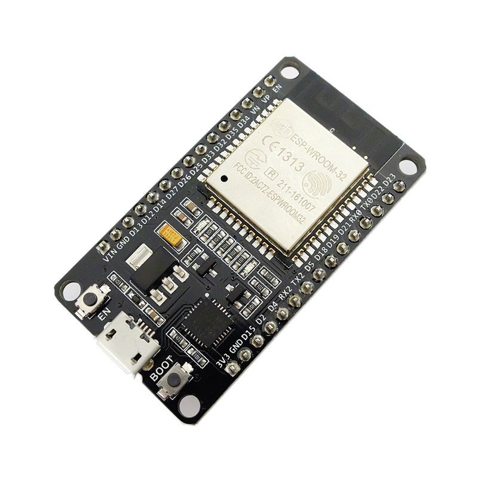

### Xilinx Virtual Cable Server for ESP32

#### Overview

This is an implementation of the `XVC - Xilinx Virtual Cable` protocol for
writing to Xilinx FPGAs from an ESP32.

Main Author: Kenta IDA (https://github.com/ciniml)

Author 2: Dhiru Kholia (remove gpio optimizations, fix `jtag_xfer` function to mimic `xvcpi`, fix portability problems)

Upstream URL: https://github.com/ciniml/xvc-esp32

This is a port of Derek Mulcahy's XVC implementation for Raspberry Pi
(https://github.com/derekmulcahy/xvcpi) to ESP32.

By connecting the ESP32 to the JTAG pins (TDI, TDO, TMS, TCK) of the target
FPGA, you can access the JTAG port of the FPGA from a Xilinx tool (Vivado,
etc.) via WiFi.


In this example photo, the M5Stack ESP32 module [M5Atom Lite](https://docs.m5stack.com/#/en/core/atom_lite) is connected to a Zynq XC7Z010 FPGA (on EBAZ4205 'Development' Board).

In this state, if you add and connect as a Virtual Cable from Vivado Hardware Manager with `Add Virtual Cable`, you can observe the waveform of ILA in the same way as a normal JTAG adapter.


#### How to use

Change the WiFi credentials in the `credentials.h` file.

Note: The default pin mappings for the common, low-cost `ESP32 WROOM DevKit v1`
development board are:

```
TDI = D25, TDO = D21, TCK = D19, TMS = D22
```

Feel free to experiment with different ESP32 development boards - most should
just work with any problems.



| ESP32 Dev Board | JTAG |
|-----------------|------|
| 25 (D25)        | TDI  |
| 21 (D21)        | TDO  |
| 19 (D19)        | TCK  |
| 22 (D22)        | TMS  |

Finally, build the program using Arduino IDE and write it to the ESP32 board.

#### How to use (Linux version)

```
make install_arduino_cli
make install_platform
make deps
make upload
```

#### Rough Performance Stats ("Speed")

Writing a small bitstream (Blinky with `PS7 IP` + Ethernet stuff) sized around
400 KiB using Vivado 2021.1 takes around 10 seconds.

Kenta-San's version may offer faster performance, perhaps at the cost of
losing some portability across different ESP32 boards.

### Tips

If you see the `End of startup status: LOW` error message in Vivado, check the
FPGA power supply's voltage and current ratings.

If cost and ease-of-availability are the driving constraints (at the cost of
speed), then this project can suffice. If higher programming speed is a
requirement, I recommend using `xc3sprog` with an FT2232H board.

### Related Ideas / Projects

- https://github.com/kholia/xvcpi
- https://github.com/kholia/xvc-pico
- https://github.com/kholia/xvc-esp8266
- https://github.com/kholia/Colorlight-5A-75B
- https://github.com/fusesoc/blinky#ebaz4205-development-board

## License

CC0 1.0 Universal (CC0 1.0) - Public Domain Dedication

https://creativecommons.org/publicdomain/zero/1.0/

Note: See `README-Original.md` for full licensing information.
