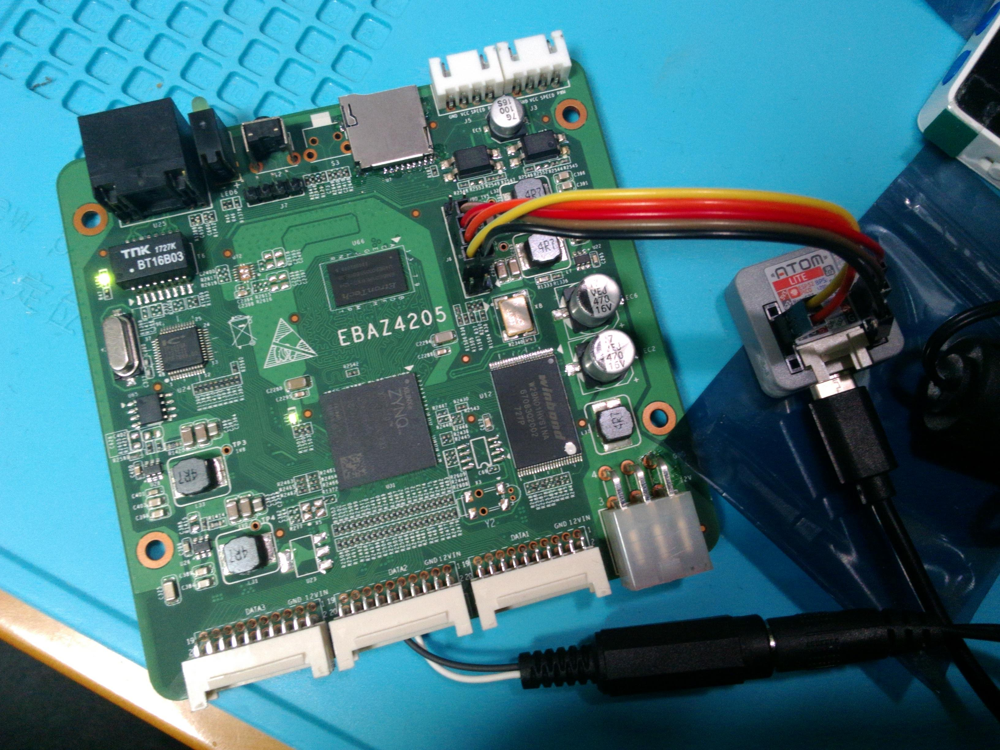
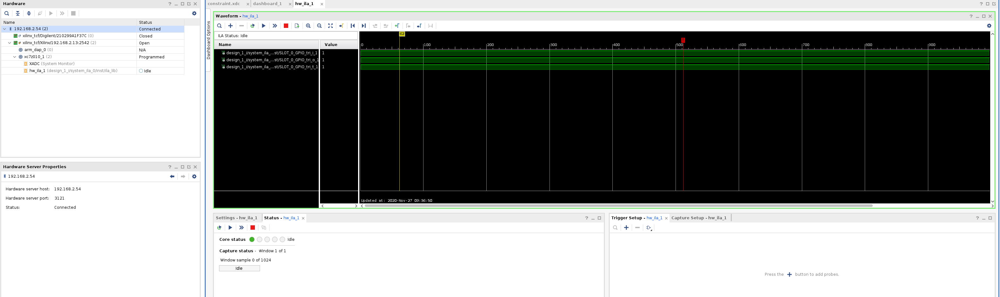

# Xilinx Virtual Cable Server for ESP32

## 概要

Xilinx製FPGAへの書き込みを行うためのプロトコル (XVC : Xilinx Virtual Cable) のESP32向け実装です。

Derek Mulcahy氏の Raspberry Pi向け実装(https://github.com/derekmulcahy/xvcpi) をESP32向けに移植しています。

ESP32を対象FPGAのJTAGピン (TDI, TDO, TMS, TCK) に接続することにより、WiFi経由でXilinx製のツール (Vivadoなど) からFPGAのJTAGポートにアクセスすることができます。



写真の例では、M5Stack製のESP32モジュール [M5Atom Lite](https://docs.m5stack.com/#/en/core/atom_lite) とZynq XC7Z010を接続しています。

この状態で、VivadoのHardware Managerから `Add Virtual Cable` でVirtual Cableとして追加して接続すると、通常のJTAGアダプタと同様にILAの波形観測などを行えます。



## 使い方

`xvc-esp32.ino` を使いたいESP32ボード向けにArduino IDEでビルドして書き込むだけです。

その際、現状のスケッチではWiFiの接続先をコードに埋め込んでいますので、適宜修正してください。

```c++
static const char* MY_SSID = "ssid";
static const char* MY_PASSPHRASE = "wifi_passphrase";
```

また、現状は M5Atom用のピン定義になっていますので、使いたいESP32ボード向けにピン定義を変更してください。

```
/* GPIO numbers for each signal. Negative values are invalid */
/* Note that currently only supports GPIOs below 32 to improve performance */
static constexpr const int tms_gpio = 22;
static constexpr const int tck_gpio = 19;
static constexpr const int tdo_gpio = 21;
static constexpr const int tdi_gpio = 25;
```

コメントにあるように、現状は高速化のためにGPIO0～31までのみ使用可能です。


## ライセンス

大本の AVNET による実装が CC0 1.0 だったので、Derek Mulcahy氏の Raspberry Pi向け実装も CC0 1.0となっています。

従って、本実装も (日本国内でのCC0の有効性はともかく) CC0 1.0 ということにします。